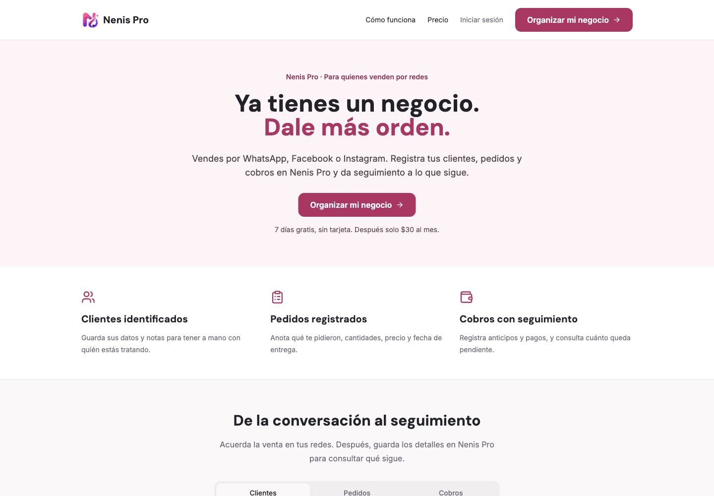
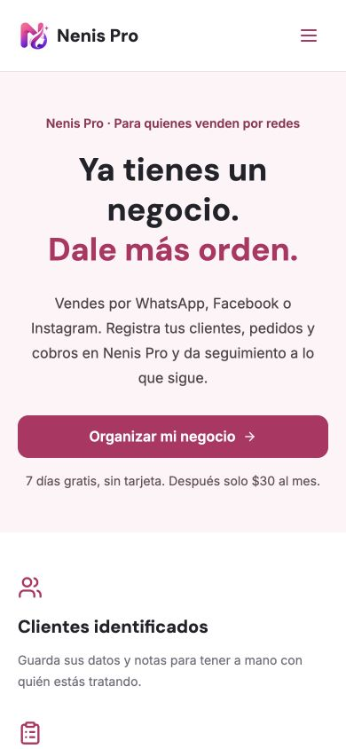
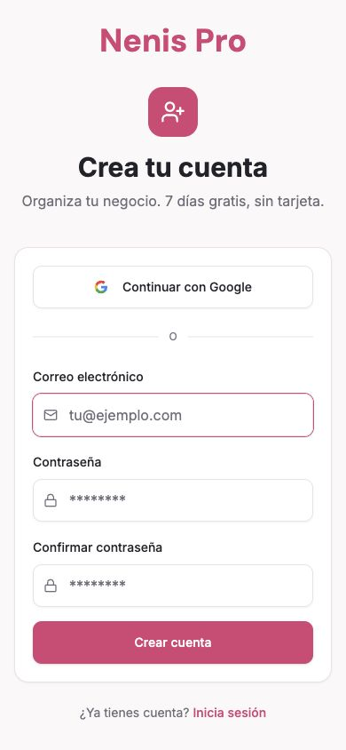

# Campana: negocio con orden

## Estado

Implementacion para revision en `codex/campana-negocio-con-orden`. No se ha
fusionado main, aplicado SQL en Supabase ni publicado produccion. No se han
activado anuncios ni publicaciones sociales.

## Auditoria y cambios

- React/Vite, React Router y Supabase. Landing: `src/pages/Landing.jsx`;
  registro: `Register.jsx`; sesion: `src/lib/AuthContext.jsx`.
- El registro anterior ejecutaba CompleteRegistration tras signUp aun sin
  sesion confirmada. Ahora una solicitud no equivale a una cuenta confirmada.
- Portada inclusiva, CTA al registro real, beneficios, ejemplos interactivos
  con componentes existentes, precio, FAQ y cierre. No se utilizan testimonios
  ni capturas inventadas. Los ejemplos estan rotulados como datos ficticios.
- Evidencia funcional: clientes en `src/pages/Clients.jsx`, pedidos y anticipos
  en `src/pages/NewOrder.jsx`, seguimiento en `src/pages/Payments.jsx` y
  persistencia en `src/api/entities.js`.
- Se mantienen 7 dias gratis, sin tarjeta, $30 MXN/mes y cancelacion vigente.
  No se promete sincronizacion de redes, procesamiento de ventas ni
  verificacion bancaria. El seguimiento requiere registros manuales.
- Metadatos y Open Graph usan el logo publico existente. Las pantallas privadas
  se cargan de forma diferida; la landing ya no espera la sesion para mostrarse.
  Se retiro de la portada la ilustracion de 1.6 MB, sin modificar su archivo.
  No se afirma una puntuacion Lighthouse ni una mejora medida en produccion.

## Contrato de medicion

| Evento | Momento | Deduplicacion |
| --- | --- | --- |
| OrganizeBusinessClick (custom) | Clic CTA | Cada clic intencional |
| RegistrationRequested (custom) | signUp aceptado o inicio de OAuth desde registro | No representa cuenta confirmada |
| CompleteRegistration (standard) | Sesion con email_confirmed_at y RPC que verifica Auth | Una reclamacion por cuenta |
| FirstOrderSaved (custom) | onSuccess de createOrder y RPC que verifica primer pedido completo | Una reclamacion por cuenta |

La migracion `supabase/migrations/20261008000000_campaign_milestones.sql`
crea un registro privado de hitos con RLS, clave unica y funcion autenticada.
La funcion valida identidad, confirmacion y propiedad del pedido en el servidor;
no confia en un identificador de usuario enviado por el navegador. La fila de
entrega es el ultimo paso de persistencia actual de createOrder.

Las cuentas creadas antes de aplicar la migracion no cuentan como registros
nuevos, tampoco al entrar con Google. Una cuenta posterior al corte que aun no
reclamo el evento puede hacerlo en su siguiente sesion confirmada. No se envia
el evento simplemente por visitar /register o /pedidos. Recuperacion queda
excluida. No se cambia la confirmacion de correo ni las reglas de acceso.

La reclamacion es atomica, pero el envio de navegador es de mejor esfuerzo:
un bloqueo de Meta o un corte despues de reclamar puede perder el evento.
No es una garantia de entrega exactamente una vez. No se reenvia a ciegas.
La medicion tiene timeout y nunca debe impedir navegar o guardar un pedido.
El primer pedido se determina sobre los registros existentes; eliminar pedidos
historicos antes de reclamar puede cambiar cual se considera el primero.

Solo se envian codigos de campana permitidos y un UUID opaco del evento.
No se envian nombres, correos, telefonos, user_id, order_id, importes ni contenido
de pedidos en los nuevos parametros de Meta. El order_id solo viaja al RPC propio.
UTM se conserva 30 dias en almacenamiento local; en correo tambien queda como
metadata de alta, y Google recibe el retorno atribuido. Sin almacenamiento ni
parametros de retorno no se puede garantizar atribucion entre dispositivos.

Codigos admitidos: ver `CAMPAIGN_VALUES` en `src/lib/campaign-analytics.js`.
Ejemplo: `/?utm_source=instagram&utm_medium=paid_social&utm_campaign=negocio-con-orden&utm_content=tia-nenis-video`.
Valores arbitrarios se descartan para evitar datos personales en parametros.
No se agrega otro pixel. Pixel y eventos se desactivan en localhost y previews.

## Verificacion reproducible

```sh
npm run lint
npm run typecheck
npm run build -- --outDir /tmp/nenis-campaign-build
node --test tests/campaign-analytics.test.mjs
PGLITE_MODULE=file:///tmp/nenis-campaign-test/node_modules/@electric-sql/pglite/dist/index.js node --test tests/campaign-milestones.test.mjs
```

PGlite se instalo fuera del repositorio, solo para verificar la migracion sobre
PostgreSQL aislado. La prueba SQL requiere ese modulo opcional; sin el modulo se
omite explicitamente. No se agregaron dependencias al proyecto.

Para pruebas visuales sin datos reales, en terminales separadas:

```sh
node tests/fixtures/auth-server.mjs
VITE_SUPABASE_URL=http://127.0.0.1:54329 VITE_SUPABASE_ANON_KEY=test-local-only npm run dev -- --host 127.0.0.1 --port 5174 --strictPort
```

El servidor ficticio solo escucha loopback y no es un backend de produccion.
`http://127.0.0.1:54329/` contiene enlaces ficticios de confirmacion y recuperacion.
No desplegar este fixture ni usar sus credenciales en Supabase.

Pruebas realizadas:
- 7 pruebas unitarias: separacion de eventos, no confirmados, duplicados,
  bloqueo/fallo/timeout, entornos, atribucion y ausencia de PII.
- SQL aislado: permisos/RLS, anonimo, cuenta historica, email pendiente, nueva
  cuenta/Google, duplicados, atribucion, pedido incompleto y propiedad cruzada.
- Navegador local: portada y registro sin desbordamientos; 320, 390, 768 px en
  portada y escritorio 1440 px; menu, CTA, tabs con flechas y FAQ con Enter.
- Registro ficticio con contrasenas diferentes y pantalla Revisa tu correo;
  confirmacion hasta Pedidos; login erroneo en espanol; retorno Google simulado;
  solicitud de recuperacion y enlace que abre Nueva contrasena, no el dashboard.
- Capturas en `screenshots/`: escritorio, movil y formulario de registro.

No se verifico envio de correo real, OAuth contra Google real, guardado de pedidos
en un Supabase de staging, cambio real de contrasena, pagos, ni recepcion de los
nuevos eventos en Meta. Las pruebas no crearon usuarios ni pedidos de clientes.
El guardado inicial de pedidos se verifico a nivel del hook y SQL aislado.

## Despliegue y pendientes antes de publicar

El historial de GitHub muestra Vercel desplegando main como Production.
`vercel.json` conserva el rewrite de SPA. La preview del PR depende de la
integracion de Vercel; usar solo el enlace confirmado por su bot/check, no inferirlo.

1. Aplicar la migracion primero en un proyecto Supabase de staging; verificar
   que las tablas orders/deliveries coincidan. Configurar las variables de la
   preview a staging, no usar produccion para pruebas que escriban datos.
2. Agregar `/auth/confirm` (con sus UTM), `/inicio` y `/reset-password` a los
   redirect URLs permitidos del proyecto adecuado. Validar correo y Google
   reales manteniendo la confirmacion requerida.
3. Resolver consentimiento y aviso de privacidad ANTES de produccion: no se
   encontro mecanismo de consentimiento y `Privacidad.jsx` declara que no hay
   cookies publicitarias de terceros, aunque el pixel existente se carga sin
   condicion de consentimiento. Este PR no inventa una politica legal ni una
   aceptacion. Auditar tambien URL/referrer y coincidencia automatica del pixel
   existente en callbacks de autenticacion; la lista permitida solo cubre los
   parametros que agregamos, no la telemetria automatica del proveedor.
4. Probar Meta en un entorno de medicion separado aprobado. Las previews no
   transmiten al dataset de produccion. Tras autorizar publicacion, comprobar
   Test Events: solicitud sin confirmar NO genera CompleteRegistration;
   confirmar genera uno; recargar/iniciar sesion no lo duplica; primer pedido
   guardado genera FirstOrderSaved; un error de guardado no lo genera.
5. Revisar y aprobar el PR. Coordinar corte de migracion y despliegue para no
   contabilizar altas anteriores al lanzamiento. No fusionar automaticamente.

## Capturas




